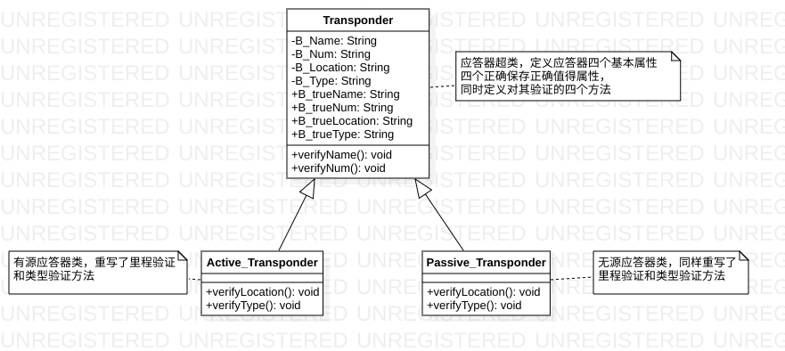

# 应答器设置规则

## 一般规则

1. 应答器组内相邻应答器的距离为 5±0.5m
2. 发送线路参数的应答器组，车站正线组内应答器组距绝缘节距离不小于 30m。应答器组距绝缘节距离从靠近绝缘节的应答器计算。
3. CTCS-2 和 CTCS-3 级列控系统的应答器组内应答器数量不宜超过3个，发送线路参数的应答器组由两个及以上应答器构成。
4. 设置在车站的应答器组中的有源应答器应靠近信号机侧。
5. 两个应答器组链接距离不小于200m。

## 命名规则

1. 每个应答器 (组) 命名应以 B 开头，后加公里标或信号机名称，其中公里标参照区间通过信号机命名规则执行，即应答器名称以该应答器 (组) 所在位置坐标公里数和百米数组成，对于 km 后的单位采用四舍五入的方式计算,下行编号奇数，上行编号偶数。
2. 应答器名称应区分应答器组内的位置，分别在应答器名称后加 "-1","-2" 等表示组内第一个应答器和第二个应答器信息。

## 编号规则

1. 应答器编号应接 "大区号-分区号-车站号-应答器单元编号-组内编号" 格式填写。
2. 单元编号规则
    - 应答器单元编号以列车运行正方向或用途为参照，按正线贯通，从小到大的原则进行编号，下行为编号奇数 ，上行为偶数。
    （对于车站管辖范围内含区间的全部应答器组进行统一编号）
    - 单元编号由三位十进制表示，编号范围为 1-255。
3. 大区编号由三位十进制表示，编号范围为 1-127。
4. 分区号由一位十进制表示，编号范围为 1-7。
5. 车站编号规则
    - 车站编号由两位十进制表示，编号范围为 1-60，一个分区的车站数量一般不超过 50 个进行分配。
    - 接分区内车站的下行方向顺次进行车站编号。

### 思路

首先，我们要知道这个车站有多少个应答器组，假如车站有五个应答器组，然后他们的编号规则就是：'001','003','005'...

```python
for (i = 1;i < 11; i+2):
    if (i<10):
        num = '00' + str(i)
    else if(i<100):
        num = '0' + str(i)
    else:
        num = str(i)
    # 这个里 num 就是正确的单元编号
    print(num)
```

## 里程规则

1. 里程应填写应答器安装的实际线路运营里程 (格式为 KXXX + XXX)，精确到米，以靠近的信号机里程为参照点。

## 类型

1. 空心三角形 "△" 表示无源应答器。
2. 实心三角形 "▲" 表示有源应答器。

## 用途

1. CTCS-0 站应答器组 [cz-c0] 设置。
2. CTCS-0 车站向 CTCS-2 区域方向出站口 (含反向) 上下行各设置两个有源应答器组（由一个有源和两个及以上无源构成），向列车发送线路数据和临时限速信息。
3. CTCS-0/2等级转换应答器组（等级转换预告、执行）

   类型：应答器组包含两个无源应答器

   里程：
    1. 等级转换预告应答器组距等级转换执行应答器组的距离大于列车按等级转换点处线路最高允许速度运行5s的走行距离。（不大于160KM/h)
    2. 等级执行应答器组设在距闭塞分区入口处30±0.5m处。（从靠近绝缘节的应答器算）处。
    3. cz-c02距zx要大于450m。
4. 定位应答器组：
    1. 仅用于定位的应答器组可为单个应答器
    2. 里程：
        - 在车站进站信号机 (含反向) 外方 250 ± 0.5m 外设置
5. 进站信号机应答器组：
    1. 类型： 进站信号机外方设置有源应答器组，包含两个无源
    2. 里程： 距进站信号机 30 ± 0.5m

## UML 数据建模属性

UML 模型如下



属性描述：

| 属性       | 中文名 | 数据类型   |
| ---------- | ------ | ------ |
| B-Name     | 名称   | String |
| B-Num      | 编号   | String |
| B-Location | 里程   | String |
| B-Type     | 类型   | String |
| B_trueName | 正确名称 | String |
| B_trueNum  | 正确编号 | String |
| B_trueLocation | 正确里程 | String |
| B_trueType | 正确类型 | String |

方法描诉：

| 方法  | 作用 |
| ---- | ---- |
| verifyName | 验证名称 |
| verifyNum  | 验证编号 |

## 编程思路

首先我们安装操作 Excel 表的三个包。

然后现通过 xlrd 包，得到 Excel 中的信息

再通过循环，得到第一行的数据

然后根据 UML 模型，我们定义了一个应答器类，它包括四个基本属性和四个保存正确值的属性，同时也包括了两个验证方法。

然后根据验证规则，有源应答器与无源应答器在里程与类型的验证实现是不同的，所以需要单独写有源应答器类和无源应答器类的里程和类型验证方法。

最后生成新的数据表，并根据验证方法返回的结果的真假，判断是否需要标红，并将正确的数据添加到后面。