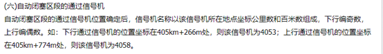
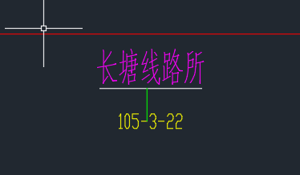

# Verification-rule
毕业设计-列控数据验证规则

## 提取应答器验证规则

首先根据研究百度文库里面的一个[应答器编号规则文档](https://wenku.baidu.com/view/fff05dc68bd63186bcebbc3c.html)，可以看到命名规则如下：

上面说公里标参照区间通过**信号机命名规则执行**，然后百度**信号机命名规则**，在铁道论坛上有这样一篇文章[信号机命名规则](http://bbs.railcn.net/thread-919589-1-1.html)，上面有这样一段描述：

根据百度上的解释，对于km后面的单位是采用四舍五入的方式计算。

下面是一个应答器编号及命名规则例子：

所以我们现在根据上面的一些规则结合吉衡线CAD图和数据表来分析：

可以看到，根据验证规则，必须以B开头，后接信号机名称，所以应答器名称为BXJF，再根据百度文库的资料，在CAD上找到区编号：

应答器编号为：`105-3-22-072`，而数据表中的编号为：

所以这条数据是错的。

现在分析B后面接公里标的应答器：

这个应答器的编号为：`105-3-23-002`，他在数据表中是:

所以也是错的，再验证公里标,

这个根据上行是偶数，下行是奇数来判断。后面的用途和备注，就涉及到你们的专业知识我就不知道了。

## 编码思路

经讨论研究，现针对验证规则的代码实现，分以下几步走

根据 UML 模型，我们需要定义至少四个变量

- B-Name: 名称
- B-Num: 编号
- B-Location: 里程
- B-Type: 类型

1. 第一步，我们先验证了里程数
2. 第二步，进行名称的验证，顺便把类型也做出来了
3. 第三步，对应答器编号进行验证
